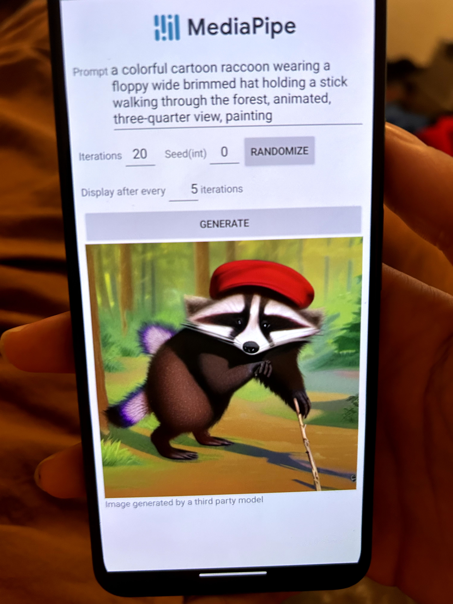

# On-Device (Android) Image Generation

This project is a generative image machine learning model built using Mediapipe for Android devices.

Below is a sample image. A video of the current WIP can be found in the /readme_examples folder.

## Image Demo

## Project Structure

The project structure is as follows:

- `app`: This folder contains the Android application code.
- `build`: This folder contains the build files and artifacts.
- `gradle`: This folder contains the Gradle build configuration files.
- `model`: This folder contains the machine learning model files.

## Getting Started

To get started with the project, follow these steps:

1. Clone the repository.
2. Open the project in Android Studio.
3. Build and run the application on an Android device.

## Dependencies

The project has the following dependencies:

- Mediapipe: [Link to Mediapipe](https://github.com/google/mediapipe)

## Usage

To use the generative image machine learning model, follow these steps:

1. Install the application on an Android device.
2. Launch the application.
3. Follow the on-screen instructions to generate images using the machine learning model.

## License

This project is an implementation of the mediapipe software licensed under the Apache-2.0 license and further documentation and links to official development is in the app/README.md file.
