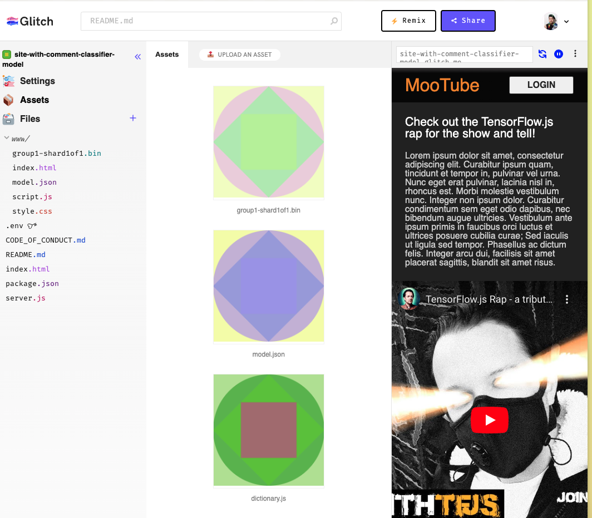
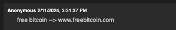
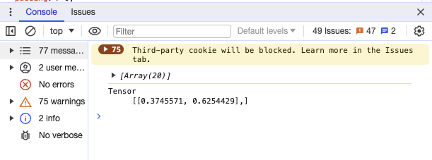
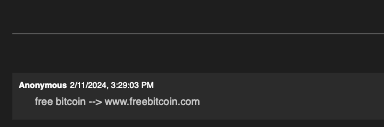

[Using Google codelab's Tensorflow.js text classification model tutorial](https://developers.google.com/learn/pathways/on-device-ml-6), I implemented a text classifier model that was deployed to / hosted on a test video blog site with a comment section. The site and model assets were built using [www.glitch.com](https://www.glitch.com) as a third party server and CDN. A CDN, or Content Delivery Network, is a distributed network of servers located in different geographic locations. Its purpose is to deliver web content, such as images, videos, CSS files, and JavaScript files, to users more efficiently and quickly. For this assignment, I used glitch.com's server and cdn to test the functionality of the web server application as if it were in a "production" level setting.

Below is an image of the glitch.com environment.

I tested the text input "free bitcoin --> www.freebitcoin.com" on the pretrained model, as it contains a mix of words and url and the model may handle words better than urls.

These are the probabilities it generated.

I then tested the same text input on the retrained model.

The probabilities vary slightly and jumped from a probability of spam in the pretrained of 62.5% to 73% in the retrained model. 

Although both comments were allowed through with the threshold of 75% being too h, therefore the model will need to be retrained further to consider this comment as spam input.

