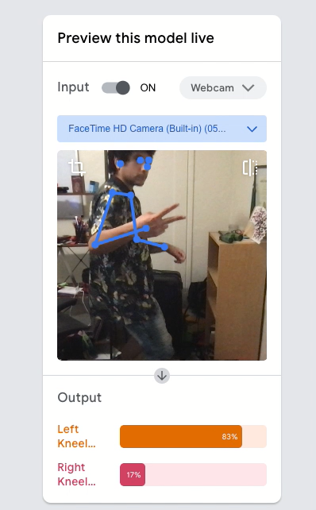
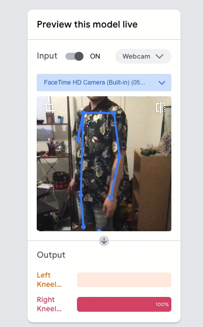

Google's Teachable Machines platform is a user-friendly tool that allows individuals to create machine learning models without any coding knowledge. It enables users to train models using their own data and then use those models to classify new inputs. This repository contains separate folders for implementing Teachable Machines for audio, image, and pose recognition.

# 3 Different Models

Google's platform currently allows users to experiment with three different model types, including an Audio model, and Image model, and a 'Pose' video model.

## Image
The model was trained on images of real kangaroos and thus cannot detect a kangaroo cartoon like in this example.

However, it can detect real images of kangaroos like in this next example.

## Pose
The model was trained on images taken from 2 different video examples where I alternated my body from the right side standing & kneeling, and then the left side, also standing and kneeling.

Left Side example is below

Right Side example is below

## Audio
The data used to train the model is in the TeachableMachines/Audio_Model directory. The link to the pretrained model seems to be broken, but it is possible to easily recreate the model by uploading the data to the teachable machines platform.